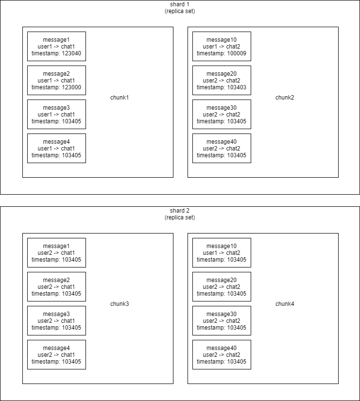

# Отчет "Масштабируемый микросервис диалогов"

Исходный код микросервиса диалогов [здесь](/dialogs-service) (также описание REST API микросервиса).

**Цель:** В результате выполнения ДЗ вы создадите базовый скелет микросервиса, который будет развиваться в дальнейших ДЗ. В данном задании тренируются навыки: - декомпозиции предметной области; - построения элементарной архитектуры проекта"
          Необходимо написать систему диалогов между пользователями. Обеспечить горизонтальное масштабирование хранилищ на запись с помощью шардинга. 
          
Предусмотреть:
- Возможность решардинга
- “Эффект Леди Гаги” (один пользователь пишет сильно больше среднего)
- Наиболее эффективную схему.

**Требования:**

- Верно выбран ключ шардирования с учетом "эффекта Леди Гаги"
- В отчете описан процесс решардинга без даунтайма

## Модель данных


Сообщения связаны с чатами связью один-к-одному. 
было заложено, что могут быть групповые чаты, поэтому добавлена сущность (документ) чат
(пока в чате могут участвовать только два человека, но планируется расширить).

Чат содержит в себе название, список пользователей чата. Чатов по-идее не должно быть много,
поэтому их можно не шардировать.

Сообщения содержат в себе id-пользователя, написавшего это сообщение, 
id-чата, к которому оно относится, timestamp времени создания и сам текст сообщения.
Сообщения шардируются **по чату, к которому они относятся** (chatId) и **по времени написания** (timestamp), 
чтобы учесть “Эффект Леди Гаги”. 
Исходил из следующих соображений: 
1. Люди обычно просматривают все сообщения одного чата, при этом сначала более новые сообщения, потом более
старые. Соответственно стоит хранить данные, относящиеся к одному чату и близкие по времени на одном шарде.
2. Человек (пользователь или пользователи в групповой чат) одновременно может писать много сообщений. 
Обычно неравномерно распределено количество сообщений между разными чатами и реже бывает пользователь, который
пишет много сообщений в разные чаты одновременно. Поэтому стоит группировать сообщения по идентификатору чата
и времени написания сообщения.
3. Так как в чат пишут обычно как минимум два человека, то хранить рядом сообщения одного конкретного пользователя (по fromId)
не логично, так как запросов на сообщения одного конкретного пользователя не будет.

Так как **timestamp** - монотонная последовательность, 
то ему лучше подходит hashed ключ шардирования. Сообщения, написанные одним пользователем, будут лежать рядом,
но в зависимости от timestamp-а на разных шардах (т.е. даже если пользователь пишет 100500 сообщений в секунду,
запись будет происходить равномерно на разные шарды).
**Id-чата** также монотонная последовательность, поэтому также используем hashed ключ шардирования для равномерного
распределения по шардам.

Шардирование происходит (примерно) следующим образом:




## Выбор DB

Для шардирования рассматривались следующие варианты:
- JDBC Sharding Driver (with PostgreSQL/MySQL)
- ProxySQL, Vitess
- PostgreSQL Foreign Data Wrapper
- MongoDB
- CoucheDB, Cassandra

Была выбрана NoSQL база данных **MongoDB**.
Запускается с помощью docker-compose файла (https://github.com/klingac/docker-compose-mongo-shard).

Краткая инструкция по запуску:
- Поднять кластер mongoDB в докере (https://github.com/klingac/docker-compose-mongo-shard, https://github.com/chefsplate/mongo-shard-docker-compose).
- Создать базу данных **social_network**.
```sql
use social_network
```
- Включить шардинг для базы данных **social_network**.
```js
sh.enableSharding("social_network")
```
- Создать индекс по полям, входящим в ключ шардирования (fromId и dateCreated). 
Сортируем по id-чата в ASC порядке, для timestamp-а в DESC порядке.
```js
db.message.createIndex({"chatId": 1, "createdAt": -1})
```
- Включить шардинг для коллекции **message**.
```js
sh.shardCollection("social_network.message", {"chatId": 1, "createdAt": -1})
```
- Запустить экземпляр (экземпляры) микросервиса подсистемы диалогов **dialogs_service** (todo: добавить докер-образ микросервиса).

### JDBC Sharding Driver (на стороне приложения)

Наиболее гибкий и удобный проект: 
[ShardingSphere - Distributed Database Middleware Ecosphere](https://github.com/apache/shardingsphere).


Проект содержит две ключевые библиотеки, которые можно использовать: **sharding-jdbc** и **sharding-jdbc-spring-boot-starter**.
Поскольку в сервисе диалогов используется spring-boot, то был выбран spring-boot стартер.

Подключение библиотек в maven:

```xml
    <dependencies>
        <dependency>
            <groupId>io.shardingsphere</groupId>
            <artifactId>sharding-jdbc</artifactId>
            <version>3.1.0</version>
            <type>pom</type>
        </dependency>

        <dependency>
            <groupId>io.shardingsphere</groupId>
            <artifactId>sharding-jdbc-spring-boot-starter</artifactId>
            <version>3.1.0</version>
        </dependency>
    </dependencies>
```

Недостатки:
- все настройки (какие данные и на какой узел пойдут) выполняются ручками в коде. 
Алгоритм шардирования тоже нужно реализовывать.
- больно решардить

Преимущества:
- подходит практически для любого типа БД

### ProxySQL, Vitess

todo: попробовать настроить (субъективно не очень понятно, как настраивать ProxySQL и 
не получилось запустить Vitess) 

ProxySQL github repository: https://github.com/sysown/proxysql

Vitess java client: https://github.com/vitessio/vitess/blob/master/java/README.md

### PostgreSQL Foreign Data Wrapper
интересно будет попробовать, но вроде почти также удобно как mongodb

### MongoDB

В MongoDB шардирование идет из коробки. Давно хотел попробовать использовать mongo,
но на мой взгляд для высоко нагруженного проекта больше подходит Cassandra.

Недостатки:
- не в полной мере реализован ACID (но для данного сервиса диалогов он особо и не нужен)
- возможны проблемы со сложными join-ами (в сервисе диалогов не используются)

Преимущества:
- шардирование идет из коробки
- также есть репликация
- можно использовать составные ключи шардирования
- процесс балансировки идет в фоне (есть из коробки):
https://docs.mongodb.com/manual/core/sharding-balancer-administration/


### CoucheDB, Cassandra

Шардирование идет из коробки, но происходит автоматически. Теоретически можно настроить, 
но сложнее чем в mongodb.

[Synthetic Sharding with Cassandra. Or How To Deal With Large Partitions.](https://medium.com/@foundev/synthetic-sharding-in-cassandra-to-deal-with-large-partitions-2124b2fd788b)

[Моделирование данных в Cassandra 2.0 на CQL3.](https://habr.com/ru/post/203200/)

[Sharding - Apache CouchDB Documentation..](https://docs.huihoo.com/apache/couchdb/2.1/cluster/sharding.html)

## Процесс решардинга

Процедура решардинга происходит с помощью внутреннего процесса mongodb, который называется balancer
(https://docs.mongodb.com/manual/core/sharding-balancer-administration/#sharding-balancing).

Перенос чанков между шардами обычно происходит автоматически:


Для ограничения и управления миграцией чанков между шардами есть возможность использовать зоны 
(https://docs.mongodb.com/manual/core/zone-sharding/).

Но также можно вручную перенести данные (в документации не рекомендуют так делать) с
помощью команды:

```js
db.adminCommand( { moveChunk : "social_network.chat",
                   find : {chatId : "123456fddr35543dsa34", createdAt : "1234567890"},
                   to : "mongodb-shard3.example.net" } )
```

Добавление шардов в кластер описано здесь:
https://docs.mongodb.com/manual/tutorial/add-shards-to-shard-cluster/

Процесс удаления шардов из кластера описан в документации здесь:
https://docs.mongodb.com/manual/tutorial/remove-shards-from-cluster/

